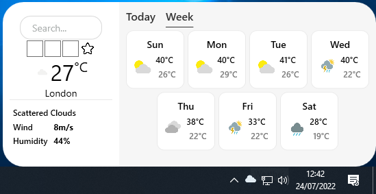
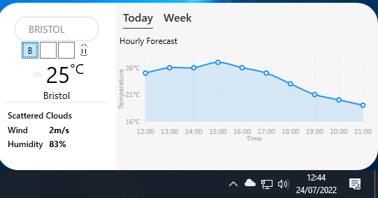

# TaskbarWeather



TaskbarWeather is an application that opens a small window which displays the weather of a given location. The app shows 3 different statistics:

* The current weather
  * Temperature (°C)
  * Wind speed (m/s)
  * Humidity (%)
  * General weather description (Clear sky/Cloudy, etc)
* The forecast for the next 7 days
  * High temperature (°C)
  * Low temperature (°C)
  * General weather description (Clear sky/Cloudy, etc)
* The hourly temperature (°C)

## Favourites



TaskbarWeather allows the user to save 3 locations to their "favourites", so that they may click on the associated box instead of typing the location in. When the user adds a favourite, the first letter of the location will be displayed in the box. 

These favourites are saved to a file on the user's local system, and are automatically saved and loaded upon creating a new favourite, or opening the application.

## How To Search
Users may search for for a location using the city name, or if necessary they can also append the state and/or country to the search. 

## Adapting the application
To clone and adapt this application, you need to create the file "\APIKeys.cs" in the root directory. This file needs to contain the following code, and you need to generate your own API Keys at the websites

* [Weatherbit.io](https://www.weatherbit.io/)
* [Openweathermap.org](https://openweathermap.org/)
* [Weatherapi.com](https://www.weatherapi.com/)
```
public static partial class APIKeys
{
    public static readonly string OpenWeatherAPIKey = "****************";
    public static readonly string WeatherBitAPIKey = ""****************";
    public static readonly string WeatherAPIKey = ""****************";
}
```
